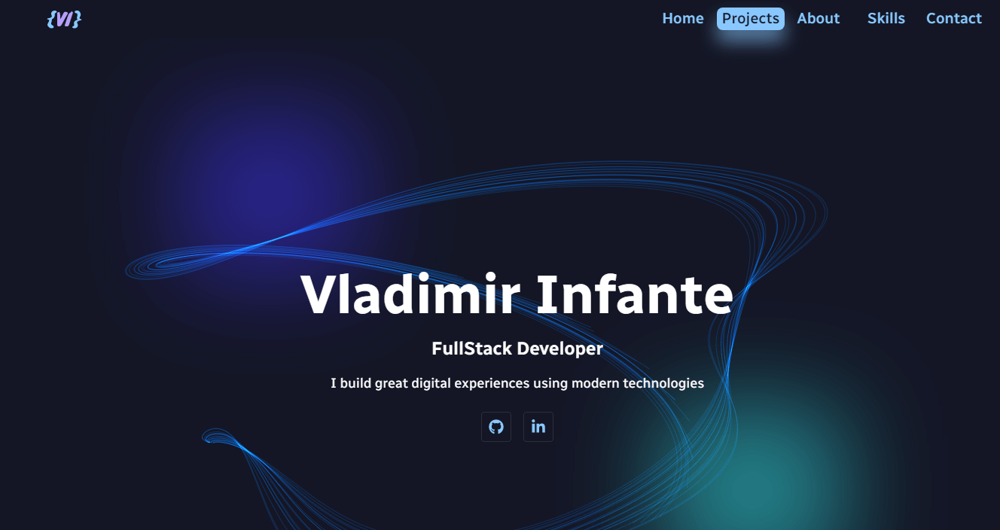
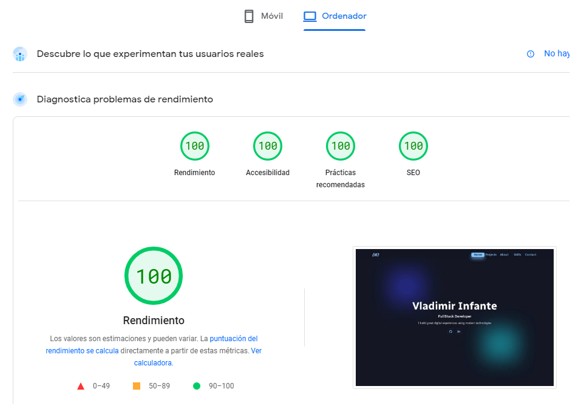

# Personal Portfolio



This is a portfolio website built with NextJs 13.2 and TailwindCss.

- Demo live: https://vlad-infante-portfolio.vercel.app/

## Features

- Engaging UI
- Smooth animations
- Input validation on forms
- Sends emails to the owner from the backend
- Optimized images
- Responsive design
- The portfolio is Server Side Rendered
- Client components are separated in small chunks to increase performance (code split / lazy load)
- This project's code uses prettier and Airbnb standards (linter rules)

## Chrome lighthouse scores:

---
According to:

https://pagespeed.web.dev/

These are the scores of the test:



## Environment Variables

---

To run this project, you will need these environment variables on your .env:

`EMAIL_USER`

`EMAIL_PASS`

`EMAIL_DESTINY`

`EMAIL_SERVICE`

`EMAIL_SENDER`

## Running this project

To run this project in your local machine you will need to introduce the following commands:

```bash
git clone https://github.com/InfVlad/Portfolio.git
cd Portfolio/
npm install 
npm run dev
```

Open [http://localhost:3000](http://localhost:3000) with your browser to see the project.

## Technologies used for this project:

---

- Next.js 13.2 (App Directory)
- React
- TailwindCss
- Axios
- Nodemailer
- TypeScript
- Framer Motion
- Prettier
- Airbnb eslint config

## Deployment:

---

This project is deployed in Vercel with a log integration to monitor the backend behavior.

- ### Design

---
I took inspiration from some designs I saw on dribbble, figma and many other places, added my own personal touch. As I said before, Im not a designer, but I believe the final product looks cool enough.
